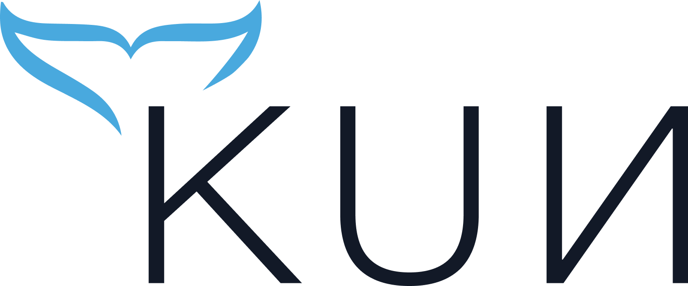

[](https://codecov.io/gh/miotech/kun-scheduler)
[](https://sonarcloud.io/dashboard?id=miotech_kun-scheduler)
<p align="center">
    
</p>

# Intro

<div align="center">
    <p>(If you are Chinese user, please read <a href="README_zh_cn.md">中文文档</a>)</p>
</div>

*Kun-scheduler* is a task scheduler specific to data engineering which takes care of both data and metadata. It can collect, organize, analyze and monitor various metadata (including storage, table, schema, data lineage, data usage, etc) for you, and unleash the full power of your Cloud-Native Data Lake.

*Kun-scheduler* aims as follows:

- Schedule and execute complex data pipelines and DAGs.
- Collect various datasource's metadata, including table name, column name, schema, last updated timestamp, row count, non-null ratio, etc.
- Generate data lineage by inspecting data tasks and pipelines.
- Event-driven data sanity check.
- Monitor task status and alert on task failure.
- Support data backfilling.

# Get Started
## Running kun-scheduler in Docker

The fastest way to start *kun-scheduler* is using Docker Compose. Make sure you have Docker and Docker Compose installed, and they meet the minimum required version.

```
Docer >= v17.03
Docker Compose >= v1.27.0
```

Then you can start *kun-scheduler* with following commands

```
curl -LfO 'https://raw.githubusercontent.com/miotech/kun-scheduler/master/dist/kun-scheduler-0.7.0-rc1.tar.gz'
tar xf kun-scheduler-0.7.0-rc1.tar.gz
cd kun-scheduler
docker-compose up
```

The bootstrap of *kun-scheduler* is a bit slow so please wait some minutes patiently. You should see below message when the bootstrap is complete.

```
kun-app_1 ... c.miotech.kun.webapp.WebApplicationMain  : Started WebApplicationMain in 28.392 seconds
```

Now you can access *kun-scheduler* web console via the url `http://localhost:8080/`. You may use the default username `admin` and password `admin` to login.

### Trouble Shooting

If you found a mysterious error message `Killed` in bootstrap, it is caused by the memory limit of docker, you need to change the configuration. Please refer to [this post](https://stackoverflow.com/questions/44417159/docker-process-killed-with-cryptic-killed-message).

# Tutorial

## Collect all tables in the Hive (Note: currently only mysql metastore supported)

1. Click "Settings" -> "Data Source Settings" on the left tab, and then click "Add Data Source" in the upper right corner.
2. The data source name can be any words, select type as "Hive", then fill in the following information

    ```
    dataSettings.field.metastoreHost: metastore db's host
    dataSettings.field.metastorePort: metastore db's port
    dataSettings.field.metastoreDatabaseName: metastore db's name
    dataSettings.field.metastoreUsername: username to access metastore db
    dataSettings.field.metastorePassword: password to access metastore db
    dataSettings.field.datastoreHost: HiveServer's host
    dataSettings.field.datastorePort: HiveServer's port
    dataSettings.field.datastoreUsername: HiveServer's username
    dataSettings.field.datastorePassword: HiveServer's password
    ```
3. After adding the data source, click the refresh button of the data source. In this way, kun-scheduler will start collecting all the table information in Hive.
4. Since the importing process needs some minutes to finish but has not yet implemented a progress bar, please be patient. After a period of time, the data source will be imported and displayed on the "Data Set" page.

## Create a Spark task and parse the input and output tables

First, we need to have a livy cluster and configure the address to kun-scheduler.

1. Click "Settings" -> "Global Variable Settings" on the left tab, and then click "Create New Variable".
2. Fill in the key as `livy.host`, and the value as the address of livy, like `http://10.0.2.14:8998`.

Then we need to upload the lineage analysis jar to HDFS.

    ```
    lineage.analysis.jar: HDFS path of lineage analysis jar
    lineage.output.path: A temp folder in HDFS, since lineage analysis process will generate some output files
    s3.access.key: if an s3 is used instead of HDFS, the access key of s3 is needed here
    s3.secret.key: same as above, the secret access key of s3
    ```

Next we start to create Spark tasks.

1. Click "Data Development" on the left tab and select "Create Task" in the upper right corner to create a "Spark" task.
2. After entering the task name, the task will be created successfully. Click the task to enter configuration page, with the following parameters

    ```
    application files: path of Spark jar. Note that the path should be a s3 or HDFS path and jar must be uploaded to s3 in advance. This parameter is required.
    application class name: main class name of Spark jar. Required.
    application jars: other additional jar packages required for the task to run. Optional.
    application args: extra command line arguments. Optional.
    ```

3. After configuring the task parameters, open the "Scheduling Config", select "Manual", and save.
4. Click the "Dry Run" button in the upper right corner to run the task.
5. If there is no problem in the trial run, click the "Commit" button in the upper right corner to push the task to production, and the scheduling will start. However, since the scheduling method we chose is "manual trigger", it will not be automatically triggered, but can be used for backfilling.
6. Go back to the "Data Development" page again, check the task you just created, and click "Run Data Backfill" in the upper right corner to trigger a data backfilling. The result of backfilling can be seen in the "Backfill Tasks" on the left tab page.

Finally, let's look at the results of lineage analysis for this task. Suppose the above task reads `dwd.transaction_details` and writes it to the `dws.transaction_summary` table. We can see the results of lineage analysis in the "Datasets".

1. Open "Data Discovery" on the left tab and click "Datasets".
2. Search the `transaction_details` table or the `transaction_summary` table, you can see the task is shown "Lineage" section.

## Build a Pipeline

With the tasks created so far, then we can create a task flow.

First, the same as above, create a new task, and then open "Scheduling Config" -> "Upstream Config". Currently supports two ways to set a dependency on another task

1. Input dataset
2. Search upstream tasks

The "input dataset" is to declare which tables are used by the current task, so that the scheduler will automatically create a dependency relationship between current task and tasks write to these tables. On the other hand, "Search upstream tasks" searches for upstream tasks by task name.

After the task dependencies are created, the scheduler will schedule the two tasks according to the dependencies.
