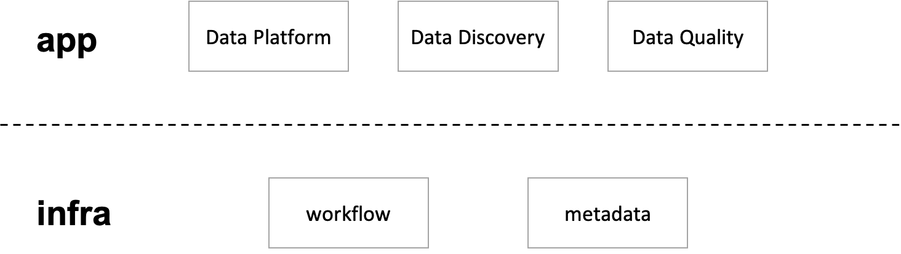

Kun 主要分为两层，提供基础能力的 **infra** 层和作为上层数据应用的 **app** 层。

infra 层主要包括 workflow 和 metadata 两个系统。

- workflow: 负责 DAG 编排，任务的调度，运行等。
- metadata: 负责元数据收集，展示，搜索等。

app 层包括以下应用：

- Data Platform: 数据开发平台，用于开发任务，调度任务，查看运行结果等。
- Data Discovery: 数据发现平台，用于查看元数据和数据血缘，搜索表和任务等。
- Data Quality: 数据质量平台，用于创建数据校验任务，监控告警等。
