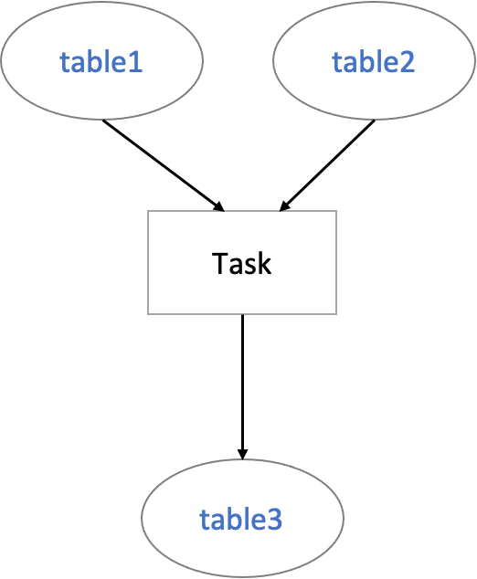

## 简介

元数据系统（metadata）是 Kun 的两大基础设施（infra）之一，他的职责就是**收集**，**存储**，**检索**所有大数据平台所需要的所有元数据。

元数据包括以下几大块：

- 数据源
- 表（包括Index，Collection等）
- 数据血缘

### 数据源

*数据源*是指一种数据存储系统，例如RDBMS，搜索引擎，分布式文件系统，云存储等。

目前 Kun 支持的数据源包括：

- Hive
- PostgreSQL
- ElasticSearch
- MongoDB
- ArangoDB

### 表

*表*是指数据源中的一个存储数据的单元（Unit），这个单元代表一种“有组织的数据集合”。最常见的就是RDBMS中的表，或是NoSQL存储中的Collection等。

### 数据血缘

*数据血缘*是指数据间的相互生成与被生成关系。Kun 通过解析任务的输入与输出，并以任务为纽带，构建起数据之间的血缘关系。

例如：

Kun 会解析出 Task 的输入是 *table1* 和 *table2*，输出是 *table3*。Kun 会将这个信息保存下来，并自动构建出 *table1* 和 *table2* 到 *table3* 的依赖。

## 架构

metadata 的架构目前正在重构之中。
