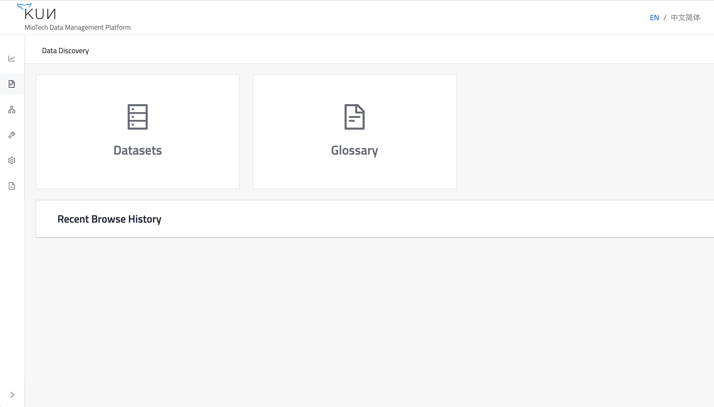
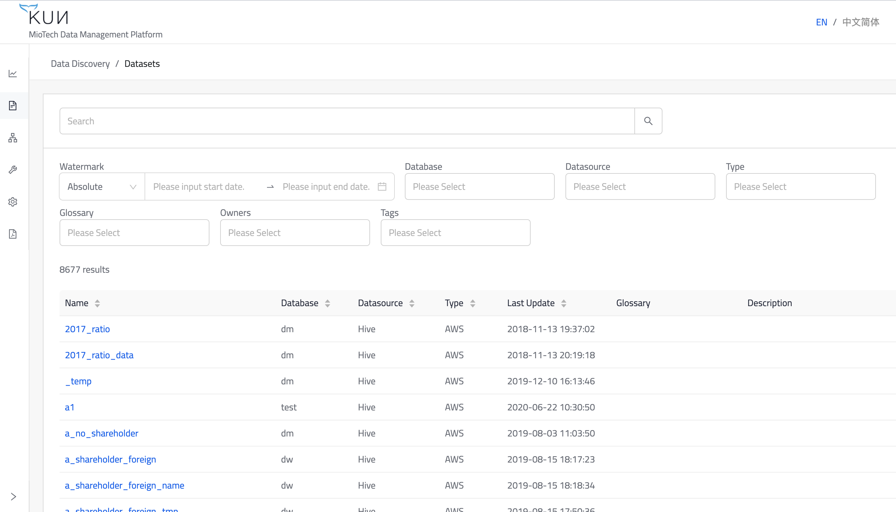
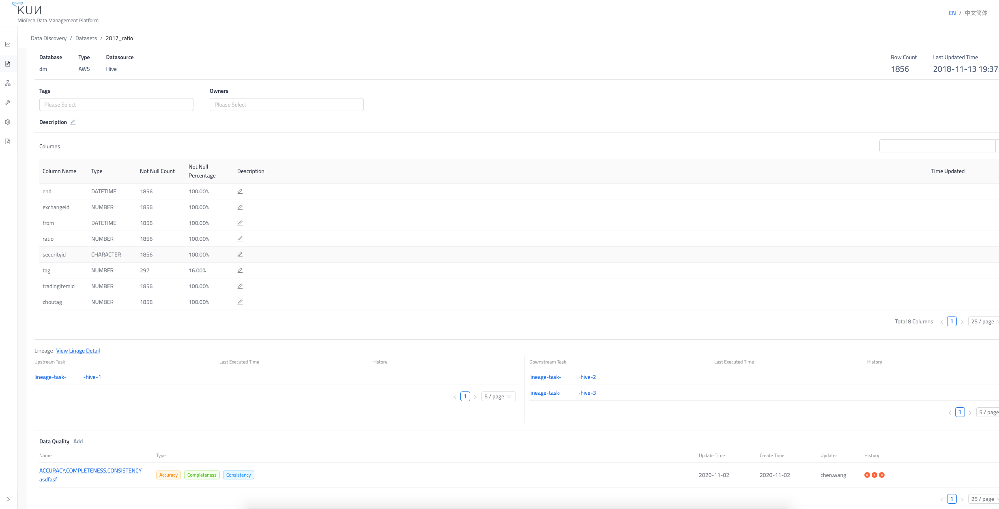
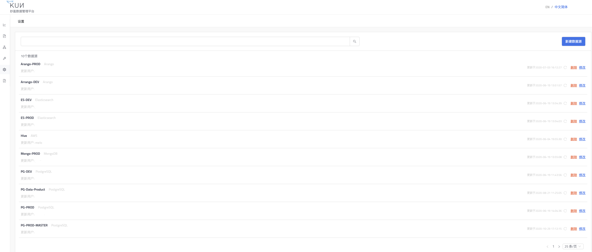
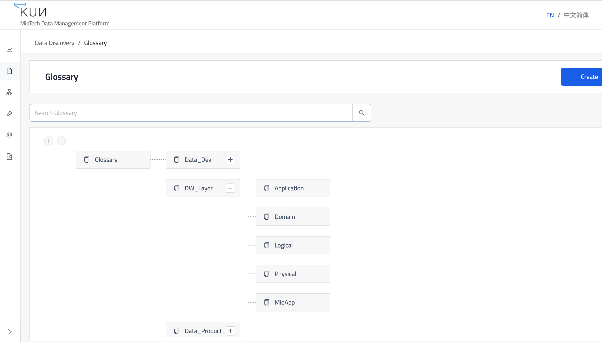
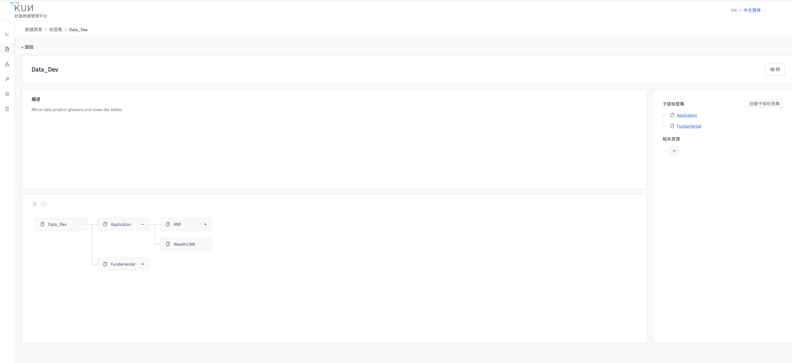

此章节将指导用户简单的了解数据探索应用，并上手使用。

入口分为三个部分，分别是数据集，标签集和过往浏览历史。其中数据集可以参考下图2，标签集可以参考下图6。

数据集以及相关元数据拉取自用户定义的各个数据源，数据源的列表可以参考下图5。数据集的信息可以按需实时更新或者每天定时更新，并如图所示支持各个维度的搜索过滤。其中包括标签、数据源、数据库、最后更新时间等。

点击进入数据集便可进入详情页面，本图上半部分展示了该数据集的元数据信息，标签信息，归属人信息，集合的列信息等。右上角的拉取功能可以让用户实时同步远端数据源对此数据集的最新改动。下半部分包括两个清单，分别是血缘关系的入口和与本数据集相关的测试用例的定义。

通过上图数据血缘的入口打开血缘的详情页面，可以清楚地追溯到数据集内的数据是如何在数据开发的任务中流转和传递的。其中每个实体都是一个数据集，每条边都是一个定义的数据开发任务。右边栏的辅助窗口则支持用户通过点击跳转到对应的详情页。

这里是用户自定义的所有数据源，当前支持的数据源类型有
- Hive
- MongoDB
- PostgreSQL
- Elasticsearch
- Arango

打开标签集，是一张目录树的结构，这个功能对于用户梳理数据集的层级关系、定义数据字典、管理数据质量都有着重要的作用。

点击进入标签集，可以看到该标签对应的含义与业务描述，还有相关联的数据集。
