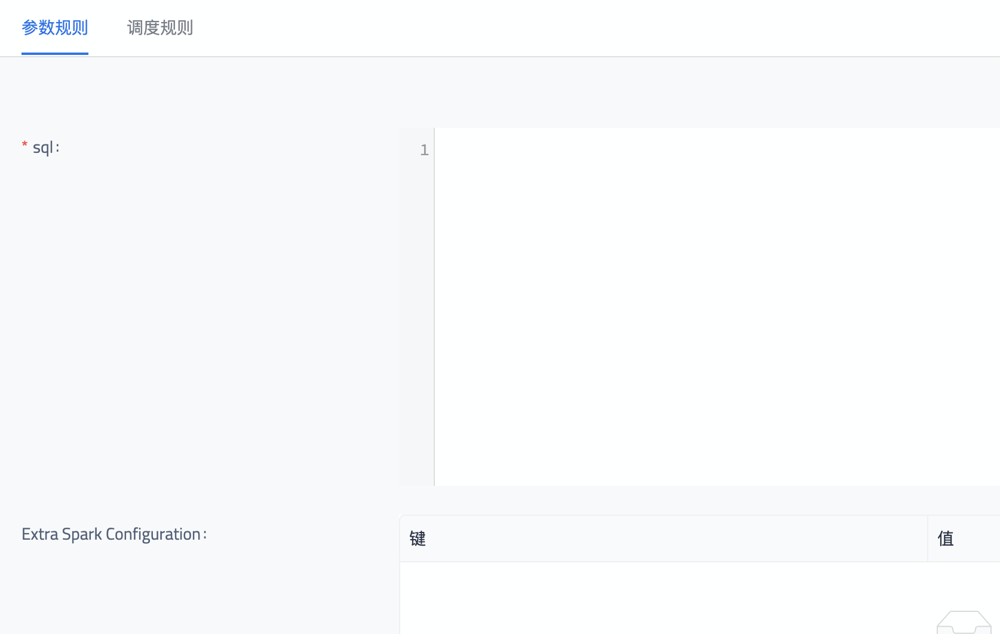
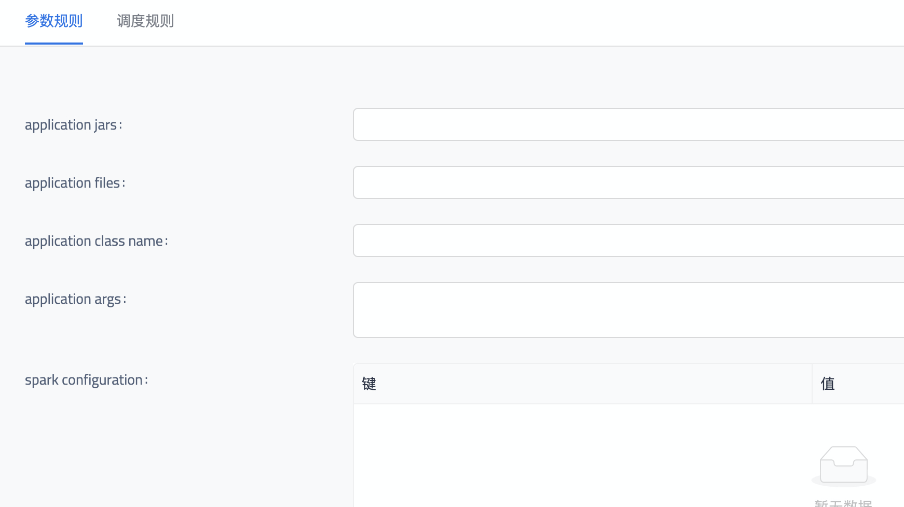

目前，Kun 共有以下内置的 Operator：

1. **SparkSQLOperator**
1. **SparkOperator**
1. **DataxOperator**

## SparkSQLOperator

`SparkSQLOperator`允许用户编写SQL对数据仓库内的数据进行清洗、计算，并写入到一个存储引擎（默认HDFS）。底层使用Spark来运行用户所写的SQL。

### 配置项

1. `sql`:（必需）用户的SQL脚本。
2. `spark configuration`:（可选）执行spark代码时的额外spark configuration。KV格式。

## SparkOperator

`SparkOperator`允许用户更为直接地运行一段spark代码（包括Java/Scala API和pySpark）。

### 配置项

1. `application files`:（必需）需要执行的spark代码，支持`.jar`和`.py`文件。其中第一个文件会被认为是main entry。
2. `application class name`:（必需）Java/Scala代码的main class。
3. `application jars`:（可选）执行spark代码时需要用到的library jar。
4. `application args`:（可选）执行spark代码时的额外命令行参数。
5. `spark configuration`:（可选）执行spark代码时的额外spark configuration。KV格式。

## DataxOperator

暂未开放。
