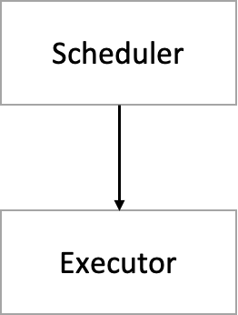

## 简介

调度系统是 Kun 的基础设施（infra）之一，主要提供任务的调度以及执行功能。大部分 Kun 的上层应用都建立在 workflow 之上。

workflow 分为两部分：scheduler 和 executor，其架构图如下：

### Scheduler

Scheduler 负责任务的调度，它解决的唯一问题就是”**这个任务是否需要运行了？**“

任务可以运行需要满足以下条件：

- 到达调度时间
- 满足上游依赖

当一个任务满足上述条件时，Scheduler 会产生对应的 TaskRun，并交给 Executor 执行。

### Executor

Executor 负责任务的执行，它需要做的就是“**正确地执行任务，并收集结果和日志**”。

workflow 默认支持多种 Executor，包括：

- Local Executor: 在本地服务器上使用进程运行任务。
- Cluster Executor: 在集群分布式地运行任务。
