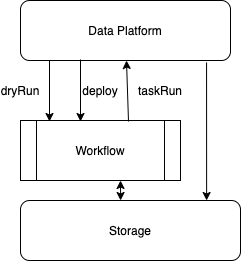
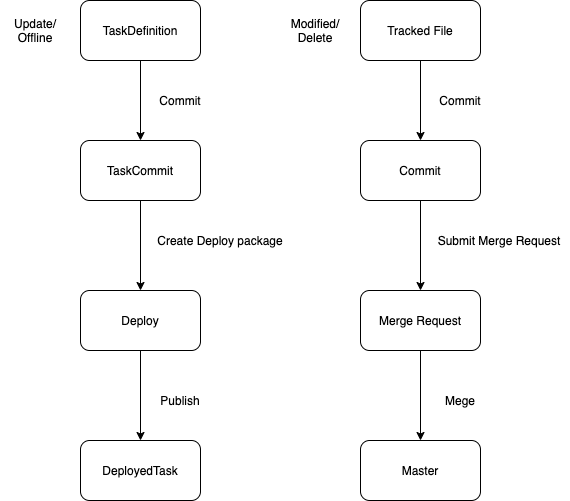
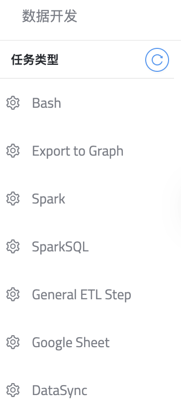

# Data Develop Platform

## Table of Content
 - [Architecture](#architecture)
 - [Build](#build)
 - [Run](#run)
 - [Templates](#templates)
 - [Test](#test)
 - [TODO](#todo)
 
## Architecture

data platform 主要提供数据开发的任务定义和部署功能，依赖于 workflow (调度器)
完成任务试运行和 定时运行功能。



### Compare with git development

data development 核心模型和 git 开发流程的对比。



 
 | data development | git development | difference | 
 | ----------- | ----------- | ----------- |
 | TaskDefinition | tracked file	 | TaskDefinition的更新和修改 可以类比 git file的修改 |
 | TaskCommit | commit	 | TaskDefinition 当前snapshot提交成为 TaskCommit。 Git file的差分 提交成为 commit |
 | Deploy | Merge Request	 | TaskCommit 提交创建 deploy package。 Git commit 提交 成为 merge request|
 | DeployedTask | merged into master | deploy 被 审核通过发布以后生成 deployed task。 Git merge request 审核之后 merge 进 master分支 |

## Build

### gradle build jar

```shell script
../gradlew :kun-data-platform:bootJar
```
### docker build image

```shell script
docker build -t data-platform .
```

## Run

data-platform  运行依赖 workflow，需要单独运行 workflow，或者直接使用docker-compose 

### using gradle
`bootRun` 只启动 data-platform 应用, 在resources  文件夹中创建 application-local.yaml
更新其中 的 workflow地址以及 db 连接的地址

```shell script
../gradlew :kun-data-platform:bootRun
```

### docker-compose

docker-compose 会启动 三个服务
- data-platform: 数据开发
- workflow: workflow 调度器
- db: 存储数据库，本地数据保存在 pg_data

请访问 [data-platform api](http://localhost:8080) 查看
```shell script
docker-compose up -d
```
## API Document
启动data-platform, 请访问 [data-platform api doc](http://localhost:8080/swagger-ui/#/) 查看

## Templates

所有templates 存放在 `resources/templates` 目录下。
提供前端选择 任务类型列表



### template 格式

template 主要有以下几个元素

- name :  template 名称
- templateType: template 类型
- templateGroup: template 分组
- operator: `workflow operator` 信息，启动时创建或者更新operator
- defaultValues: operator 的默认参数
- displayParameters: 前端展示的参数
- renderClassName: 从 template 将 task definition 渲染 workflow task的类型

如下 是spark template 的示例
```json
{
  "name": "Spark",
  "templateType": "spark",
  "templateGroup": "development",
  "operator": {
    "name": "Spark_Operator",
    "description": "Spark Operator",
    "className": "com.miotech.kun.workflow.operator.SparkOperator"
  },
  "displayParameters": [
    {
      "name": "jars",
      "type": "string",
      "required": false,
      "displayName": "application jars"
    },
    {
      "name": "files",
      "type": "string",
      "required": false,
      "displayName": "application files"
    },
    {
      "name": "application",
      "type": "string",
      "required": false,
      "displayName": "application class name"
    },
    {
      "name": "args",
      "type": "text",
      "required": false,
      "displayName": "application args"
    },
    {
      "name": "sparkConf",
      "type": "keyvalue",
      "required": false,
      "displayName": "spark configuration"
    }
  ],
  "defaultValues": {
    "jars": "",
    "files": "",
    "livyHost": "${ dataplatform.livy.host }",
    "sparkConf": "{}",
    "variables": "{}",
    "application": ""
  },
  "renderClassName": "com.miotech.kun.dataplatform.common.tasktemplate.renderer.SparkConfigTaskTemplateRender"
}

```
### workflow operator

目前 templates 需要依赖 workflow中创建或者存在以下 operator，需要手动创建和上传对应 jar包。
 
  | operator name | classname | repo |
  | ----------- | ----------- |----------- |
  | Spark_Operator| com.miotech.kun.workflow.operator.SparkOperator | kun-workflow/kun-workflow-operators/spark-operators |
  | SparkSQL | com.miotech.kun.workflow.operator.SparkSQLOperator |kun-workflow/kun-workflow-operators/spark-operators |
  | Bash | com.miotech.kun.workflow.operator.BashOperator | kun-workflow/kun-workflow-operators/bash-operator |

### workflow variables

 template 中定义了多个 `workflow variables`， 方便在运行时 `taskRun` 灵活定义和修改参数。这些 variable都需要预先定义在workflow中
 所有的variable都必须定义在 `dataplatform` 这个 namespace下。
 
 其中：
 
 | variable name | value |
 | ----------- | ----------- |
 | dataplatform.livy.host | 所有spark operator 运行的livy host地址 |
 | dataplatform.etl.jar | Etl 项目的jar包地址， `General Etl`和 `Export to Graph`需要 |
 | dataplatform.datasync.jar | DataSync spark jar包地址， `DataSync`需要 |
 | dataplatform.datasource.$datasourceId | datasouceId对应的Datasource信息， `DataSync`需要 |

 
### 通过api 创建和更新 template

用户可以在运行时，通过 api 手动添加和更新 template。
template信息需要额外包含 workflow 已经存在的operatorId。

REQUEST :

`POST /task-templates`
```json
{
  "defaultValues": {},
  "displayParameters": [
    {
      "displayName": "string",
      "name": "string",
      "required": true,
      "type": "string"
    }
  ],
  "name": "string",
  "operatorId": 0,
  "renderClassName": "string",
  "templateGroup": "string",
  "templateType": "string"
}

```

`Note`: 如果通过 api 修改了 resources 中定义的 templates 相关的配置，需要同步修改相对应的 template json定义。
否则下次部署时，会用 json 文件中的配置覆盖。

## Test
```shell script
../gradlew :kun-data-platform:test
```
## TODO
- [ ] workflow: 提高调度能力
- [ ] workflow: graceful shutdown
- [ ] dataplatform: 根据数据输入输出 来自动构建依赖
- [ ] dataplatform: datasync 支持 column mapping 和定义
- [ ] dataplatform: 消息推送， 失败的任务能够推送消息给对应负责人


